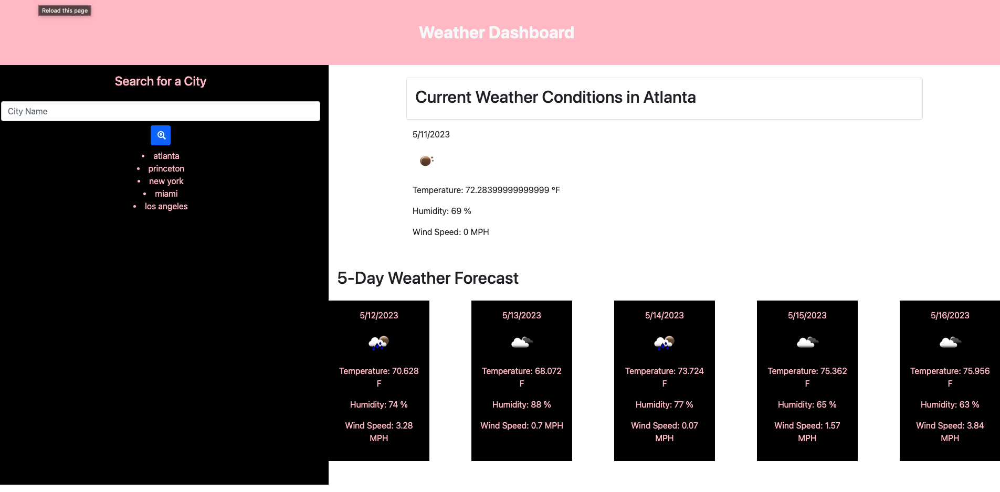

# Weather Dashboard

## Description

This is a weather dashboard that will run in the browser and feature dynamically updated HTML and CSS. It uses the [OpenWeather API](https://openweathermap.org/api) to retrieve weather data for cities.

## Table of Contents
- [User Story](#user-story)
- [Installation](#installation)
- [Technologies](#technologies)
- [Demo Images](#demo-images)
- [Websites](#websites)
- [Author](#author)
- [License](#license)

### User Story

- AS A traveler
- I WANT to see the weather outlook for multiple cities
- SO THAT I can plan a trip accordingly

### Installation

1. Clone or download the repository to your own local machine and run it from your command line on Visual Studio Code
2. Open the index.html file in your browser
3. Search for a city in the search bar

### Technologies

- Visual Studio Code
- JavaScript
- HTML
- CSS

### Demo Images

### Websites

- [Github Repo](https://github.com/kimberlie901/Weather_Dashboard)
- [Deployed Website](https://kimberlie901.github.io/Weather_Dashboard/)

### Author

This application was created by Kimberlie Guillaume

- [Github](https://github.com/kimberlie901)
- [Portfolio](https://kimberlie901.github.io/Professional_Portfolio/) 
- [LinkedIn](https://www.linkedin.com/in/kjguill1024/)

### License

Please refer to the LICENSE in the repo. Copyright (c) Kimberlie Guillaume. All rights reserved. 